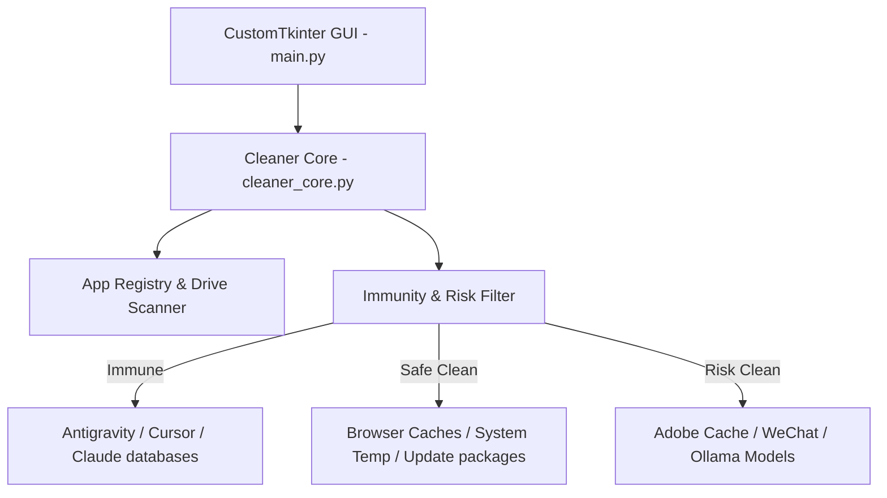

# SafeCleanerPro 🧹✨

<div align="center">
  
  <br/>
  
  
  
  
  
</div>

<br/>

**SafeCleanerPro** is an open-source, highly targeted system optimization and deep-cleaning utility specifically designed for **AI Developers, Software Engineers, and Digital Designers** on Windows. 

Unlike generic cleaning software that wipes critical developer assets or breaks your local environment, SafeCleanerPro is context-aware. It features a unique **AI-Agent Memory Immunity Net** and specialized cleaning filters designed for heavy developer/designer workflows.

---

## 🌟 Key Pillars & Features

### 1. 🧠 AI-Agent Memory Immunity Protection (智能体免擦除网)
Modern AI-driven coding environments store critical local context, neural weights, and agent memories. SafeCleanerPro features hardcoded, immutable safety shields that **guarantee** the following directories are never touched:
*   **Antigravity (Google Gemini) Agent:** `.gemini/antigravity/*` (Local memory neurons and session states)
*   **Cursor IDE:** `AppData/Roaming/Cursor/*` (Model context indexes and system configuration)
*   **Claude Desktop:** `AppData/Roaming/Claude/*` (Local conversation logs and DB indexes)

### 2. 💻 Deep Developer Space Cleaning (开发者深度调优)
Maintains your workspace hygiene by safely purging compiler residuals, caching layers, and oversized temporary distribution directories:
*   **PyInstaller Temp residuals:** Safely deletes orphaned `_MEI*` transition folders left behind by single-file EXEs after crashes (automatically skipping current active runtimes).
*   **Pip & NPM Global Caches:** Cleans out npm cache and pip downloads.
*   **VS Code Caches:** Safely removes `CachedData`, `Cache`, and extension `.vsix` leftovers.
*   **AI Weights Management:** Provides controlled scanning and cleanup of Hugging Face Hub models and Ollama local weight directories (`~/.ollama/models`).

### 3. 🎬 Designer Suite Deep Cleaning (创意设计全家桶专项清理)
Creative workloads generate hundreds of gigabytes of media caches. SafeCleanerPro scans and cleans:
*   **Adobe Premiere Pro & Media Encoder:** Media Cache Files, Peak Files (`.pkf`), and audio buffers across all system drives.
*   **Adobe After Effects:** Synthetic render previews and AE Disk Caches.
*   **Adobe Photoshop:** Temporary workspace files (`Photoshop Temp*`) and Auto-Recover directories.
*   **Adobe Illustrator & Lightroom:** Grid thumbnail caches, Acrobat resources, and vector rendering temp files.

### 4. 🌐 Smart Browser & System Cleaning (基础系统与网络净化)
*   **Chrome, Edge & Firefox:** Wipes cache directories without touching saved passwords, cookies, or bookmarks.
*   **Windows Services:** SoftwareDistribution update packages (`Download/*`), WER crash diagnostic logs, and `C:\Windows\Temp` leftovers.
*   **GPU Driver Installers:** Cleans NVidia Downloader and AMD driver setup residuals.

---

## 🏗️ Architecture Design

SafeCleanerPro is built with modularity and safety as core architectural goals:



*   **`cleaner_core.py`:** Holds the scanning engine, registry lookup routines, dynamic size computation, and the safety filter rules.
*   **`main.py`:** Built on `CustomTkinter`, delivering a beautiful, fluid dark-themed dashboard.
*   **`hwid_utils.py`:** Handles workstation diagnostics and system hardware tracking.

---

## ⚙️ Technical Details & Safeguards

### Safety Levels
SafeCleanerPro segregates all targets into two risk profiles:
1.  **Safe Clean:** Operations like clearing browser cache or WER logs. Safety factor: 100%. No operational changes.
2.  **Risk Clean (User Warning required):** Purging items like Adobe media cache (requires regenerating audio waveforms) or chat attachments (WeChat/QQ/WeCom). These files require manual opt-in and trigger explicit user confirmation popups.

### Registry-Based Discovery
Rather than hardcoding file paths, SafeCleanerPro queries the Windows Registry (`winreg`) to dynamically resolve directory paths for complex software setups (e.g., custom WeChat FileSavePath, Documents user folder locations).

---

## 🚀 Getting Started

### Prerequisites
*   Windows 10 or 11
*   Python 3.12+ (if running from source)

### Installation (Source)

1. **Clone the Repository:**
   ```bash
   git clone https://github.com/Hwalme/SafeCleanerPro.git
   cd SafeCleanerPro
   ```

2. **Install dependencies:**
   ```bash
   pip install -r requirements.txt
   ```
   *(Note: SafeCleanerPro relies on `customtkinter` for its premium dark mode UI)*

3. **Run the Application:**
   ```bash
   python client_app/main.py
   ```

---

## 🤝 Contributing & Code of Conduct

We encourage contributions to expand SafeCleanerPro's cleaning filters. Please read our [Contributing Guide](CONTRIBUTING.md) to learn how to add custom filters, and read our [Code of Conduct](CODE_OF_CONDUCT.md) to keep our community positive.

## 📄 License

Distributed under the MIT License. See [LICENSE](LICENSE) for more information.

---

<div align="center">
  Maintained with ❤️ by the SafeCleanerPro Developer Team.
</div>
